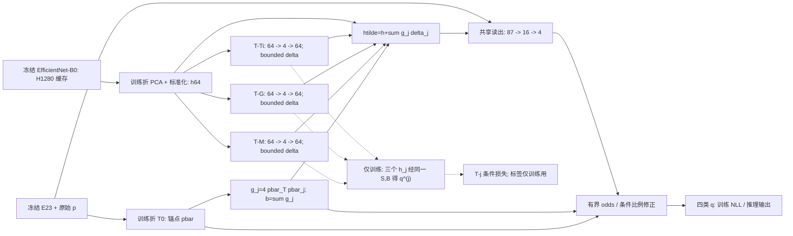

# 轻量角色条件特征适配与有界修正规格

## Material Passport

- 日期：2026-10-06；版本：`LC-RFA-B v1`，研究候选，不是已验证网络。
- 用户本轮授权：**同意先写轻量角色适配规格**。
- 状态：`DRAFT_FOR_WRITTEN_SPEC_REVIEW`。方向已同意，本文尚待书面审核；不据此实施网络、训练、打开其他真实折或修改正式报告。
- Origin Skill / Mode：brainstorming / architectural；academic-research-suite / experiment-agent plan。
- Verification Status：`UNVERIFIED`（新网络未实现、未训练；新命题仅有本规格内的作者解析推导）。
- 当前来源提交：`d94f77d9e0240283e526168ba121c00c3b643a2f`。
- 研究目的：提高技术报告与第一篇论文中**可被实验支持的网络方法贡献**，而非仅增加公式、模块名称或审美复杂度。
- 本规格的对照与训练设置是供审核的设计要求，不是已经登记或获准执行的实验协议。

## 1. 研究问题与成功含义

当前 B 主线保留四类角色视觉代理任务，C 的阶段条件决策、真实送检成本、品位与流程研究继续后置。类别顺序不变：`0 target_mineral`、`1 ti_bearing_negative`、`2 gangue_negative`、`3 metallic_hard_negative`，简记为 T、Ti、G、M。

研究问题是：

> 冻结已有视觉骨干，在相同视觉证据、监督、输出限制及可比参数预算下，角色专门化的非线性特征适配是否优于普通适配器，并在概率质量与目标—干扰风险之间取得可重复的改进？

“成功”至少需要三层证据：结构确实改变有效特征；数学边界与实现一致；同参数强对照和冻结后的新确认数据支持独立收益。仅初始化等于原模型、约束零违规、fit 损失降低或胜过未收敛头，都不足以证明网络创新有效。

本轮不重启复核人、日期及三条排除原因的工作，也不将它们作为规格编写的阻塞项；不补写虚构的质控证据。

## 2. 为什么需要此规格

已有记录形成如下设计约束：

| 已有证据 | 对新设计的约束 |
| --- | --- |
| [锚点凸对照](../../experiment_records/2026-10-05_anchor_linear_controls_results.md)可靠求解后，EH 的 stop NLL 仍为 2.293961，T0 为 0.835191 | 不能继续用“不够收敛”解释所有失败；保留强后验，限制修正能力 |
| [通道诊断](../../experiment_records/2026-10-05_bounded_role_residual_theory.md)显示约 72.27% 的 EH stop 净损失增量来自非目标条件分配 | 目标质量与非目标分配都要审计，不只优化目标召回 |
| [双通道等价核查](../../experiment_records/2026-10-06_role_residual_equivalence_and_novelty.md)证明逐点重参数化 | 双头输出及同可行域的解析性质不能独占地作为网络创新 |
| [固定图头核查](../../experiment_records/2026-10-06_role_graph_head_audit.md)证明固定线性聚合可合并，树图正边权可能不生效 | 不再依赖固定图输出头；角色机制放到非线性特征学习和专门化监督中 |
| stop 已多次被查看 | 只能用于开发诊断；不能用它挑预算、轮次或模型，再称独立测试 |

上述负结果保留，不被新规格覆盖。当前拟合集为 340 张、340 个 `split_group_id`，类别为 T=66、Ti=130、G=97、M=47；它并非足以支持大网络的新数据集。

## 3. 输入、冻结范围与预处理

后续开发只拟使用已存在的 Fold 0 缓存，不读新图片、不重算或更新骨干。现有冻结 EfficientNet-B0 的池化特征为 1280 维；本方法训练的是**池化特征之后的适配模块**，不是骨干内部 LoRA，也不是端到端骨干改进。

| 输入 | 约定 |
| --- | --- |
| 原始后验 p | 现有 `oos_pre` 四类概率，严格正、行和为 1；不改用另一后验分支 |
| 原始视觉 H | `outputs/training/abmp_frozen_visual_probe_v1/development_fold_0/frozen_features.pt` 的 fit/stop 两数组，均为 340 x 1280 |
| 概率证据 E23 | 现有 E18、四列 log(p)、矛盾量 L；p/L 可由 E18 恢复，显式加入不是新统计信息 |
| 行身份 | 两子集清单的 `image_id`、`split_group_id`、`relative_path` 和四类标签精确对齐 |
| 原骨干 | `outputs/training/tc_oos_rsg_v1/fold_0/expert/best_model.pt`，只校验身份，不重新载入图像提取 |

参考缓存 SHA256 为 `6bbb3221293d5bf0fcadb13bcaa7a3029fdc77e8328e119820665256e3509090`；骨干 SHA256 为 `ea50dbee3c8f6860ec4c901d180ad50959f51e97e8b5cb7cdc2d7e11d799e8f2`。正式预登记须重新检查这些文件及相关源表，不凭本文件中的字符串认定数据完整。

每个 fit 内交叉验证训练折分别重拟合：无标签 PCA64、PCA 列标准化、E23 标准化与正全局温度 T0。均值/总体标准差仅来自该训练折，标准差下限 1e-8；使用现有 full-SVD 及载荷符号规范，不 whitening。不能复用在全部 340 张 fit 上训练的 `preprocessing.pt` 进入内层验证。冻结专家本身不在这些内折重训，结论限于当前固定专家条件。

最后用全部 fit 重拟合预处理，再应用于 stop。记标准化视觉为 h∈R64、证据为 e∈R23。强锚点及条件非目标比例为

$$
\bar p=\operatorname{softmax}(\log p/T_0),\quad
t=\bar p_T,\quad w_j=\bar p_j/(1-t),\ j\in\{\mathrm{Ti},\mathrm G,\mathrm M\}.
\tag{1}
$$

所有锚点、PCA、标准化统计在训练该候选时冻结。推理不输入真实标签、错分标记或 stop 统计。逐图无 BatchNorm、无 Dropout、无推理时邻居检索，避免批次依赖。

## 4. 具体网络与结构草图

### 4.1 三个非线性瓶颈适配分支

三个分支分别绑定 T–Ti、T–G、T–M，包含 G 是为了避免把它从完整四类表示中删除。每个分支独立训练矩阵 V_j∈R(4x64)、U_j∈R(64x4) 及偏置 b_j∈R4：

$$
\delta_j(h)=\frac{\varepsilon_f}{\sqrt{64}}
\tanh\!\left(U_j\operatorname{SiLU}(V_jh+b_j)\right),
\quad \varepsilon_f=1.
\tag{2}
$$

外层 tanh 按坐标施加，U 不带偏置。每分支 516 个参数，共 1548。瓶颈宽度固定为 4，不在已暴露 stop 上选秩。这里的“低秩”指瓶颈线性映射宽度；不能把整个非线性函数的秩简单宣称为 4。

从锚点计算固定的角色竞争系数与整体二分类不确定度：

$$
g_j=4\bar p_T\bar p_j,\quad
b=\sum_jg_j=4t(1-t)\in[0,1],\quad
\widetilde h=h+\sum_jg_j\delta_j(h).
\tag{3}
$$

这些是后验启发式，不是已知正确性概率或专家确认的选矿成本。它可能抑制高置信错误的纠正，必须报告该失败模式。角色专门化须结合第 5 节监督验证；仅给自由分支换个 Ti/M 名称没有语义约束。

### 4.2 共享非线性读出

主输出与三个训练专门化输出共享同一读出 F：

$$
F(z,e)=W_2\operatorname{SiLU}(W_1[z;e]+a_1)+a_2\in\mathbb R^4.
\tag{4}
$$

尺寸为 `Linear(87,16) -> SiLU -> Linear(16,4)`，含偏置，共 1476 参数。主路径使用 z=\widetilde h，辅助路径分别使用 z=h_j=h+δ_j。辅助路径只在训练中使用，没有三个额外分类头。**同一网络共 3024 个可训练参数**，不含冻结骨干与预处理。

适配后的特征必须先经过式 (4) 非线性，再得到修正；不能把 U_j、V_j 全部换成直接输出 logit 的固定线性边头，并继续沿用本网络名称。普通大 MLP 仍可能表示相同函数，因此不主张相对所有普通网络具有更强的无约束表达能力。

### 4.3 有界输出层

设 F=(a_T,a_Ti,a_G,a_M)，固定全局预算上限 \bar α、\bar β，使用同一 b 缩放逐样本预算：

$$
\alpha(x)=\bar\alpha b(x),\quad\beta(x)=\bar\beta b(x),\quad
u=\alpha\tanh(a_T),\quad v_j=\tfrac{\beta}{2}\tanh(a_j).
\tag{5}
$$

$$
q_T=\sigma(\operatorname{logit}t+u),\quad
r_j=\frac{w_je^{v_j}}{\sum_kw_ke^{v_k}},\quad q_j=(1-q_T)r_j.
\tag{6}
$$

同样的输出算子用于每个 h_j 辅助视图，基准锚点及预算仍取原始 x 的式 (1)、(3)，不能由辅助预测重算。无可学习预算头。对照也使用相同预算及算子，不能把通用输出保护归功于角色适配。

数值实现要求：以 log-softmax、logsumexp、logsigmoid 计算 log(q)；用 `g_j=4 exp(log(pbar_T)+log(pbar_j))` 和 Σg_j 避免 1-t 的抵消。原 p 非法时直接失败，不无记录地裁剪后冒充同一锚点。

### 4.4 初始化与可训练性

U_j=0、共享读出最后 W_2=0 且 a_2=0；其余层按固定种子初始化。初始 δ=0、q=\bar p。第一次反传中适配器梯度可能为零，读出更新后才获得信号；初始化恒等不等于所有层立即学习。必须记录各层前 5 次更新的梯度范数；恒零或不可区分不能被隐藏。

### 4.5 网络结构草图（设计态，尚非论文实测图）

实线为推理主路径；辅助视图实际是 h+δ_j，不是仅 δ_j。批准实现后才制作与真实模块名、参数量、实测尺寸一致的 SVG/PDF 网络图，不把此草图当作已实现架构。

## 5. 角色专门化监督

令 I_j={i:y_i∈{T,j}}，q_i^(j) 表示共享读出在 h_j 上的完整四类输出。使用仅针对该对的条件概率：

$$
s_i^{(j)}=\frac{q_{i,T}^{(j)}}{q_{i,T}^{(j)}+q_{i,j}^{(j)}},\quad
L_{\rm pair}=\sum_jc_j\frac1{|I_j|}
\sum_{i\in I_j}\operatorname{BCE}(\mathbf1_{y_i=T},s_i^{(j)}),
\quad (c_{\rm Ti},c_G,c_M)=(1,1,1)/3.
\tag{7}
$$

不预设任一错误的工业经济代价。即使强调 Ti/M 两类困难干扰，也不给 G 更少的未证实损失权重。辅助标签来自已有四类标签，不是额外标注信息或新增矿物真值。

$$
L=\frac1n\sum_i[-\log q_{i,y_i}]
+0.10 L_{\rm pair}+\frac{\lambda}{2}\|\theta\|_2^2.
\tag{8}
$$

θ 为全部可训练权重及偏置，冻结骨干不进入正则。全批次训练确保每对均有样本；某内折缺类就终止，不静默改变损失。主 NLL 不加类别权重，避免把不同目标下的概率质量直接比较。

辅助视图让角色监督和各自适配器绑定，主路径路由再利用这些专门化特征。它仍属于多任务/多视图归纳偏置，不保证分支真的专门化；必须检查 q^(j) 的每对损失、δ_j 范数、跨分支相似度和梯度。不会自动采用 PCGrad、对比损失、伪标签或新联合损失模块。

## 6. 三个理论部分与证明边界

### 命题 A：恒等锚点与双层幅度限制

式 (2) 逐坐标绝对值不超过 ε_f/√64，因此 ||δ_j||2≤ε_f。式 (3) 各 g_j 非负且总和 b≤1，三角不等式给出

$$
\|\widetilde h-h\|_2\le\varepsilon_f b,
\quad |u|\le\bar\alpha b,
\quad\operatorname{span}(v)\le\bar\beta b.
\tag{9}
$$

式 (6) 是严格正的有效概率分布。最后读出为零时无论隐藏层状态如何均 q=\bar p；关闭适配分支仅 δ=0，**不等于**将训练后的读出恢复为零。t 趋近 0 或 1 时预算随 b 趋零，输出修正受抑制，也包括原模型的高置信错误。

这是幅度限制的解析性质，不是“目标召回安全”。t(1-t)、有界激活和恒等初始化均为通用设计，不能单独宣称原创。

### 命题 B：角色特征扰动的二阶不确定度抑制

固定同一输入的锚点、e、预算和同一训练后读出 F，令 q^adapt 用 \widetilde h，q^plain 用 h。设读出对视觉坐标满足

$$
\|F(z,e)-F(z',e)\|_\infty\le L_F\|z-z'\|_2.
\tag{10}
$$

可用矩阵谱范数给出保守证书 L_F≤[1+exp(-1)]||W_2||2||W_1,h||2，其中 W_1,h 是视觉 64 列。理由是 SiLU'(a)=σ(a)+aσ(a)[1-σ(a)]，且 |a|σ(a)[1-σ(a)]≤|a|exp(-|a|)≤exp(-1)，故导数绝对值≤1+exp(-1)；并非最紧界。

tanh 为 1-Lipschitz，故 |Δu|≤\bar α b L_F||Δh||2，span(Δv)≤\bar β b L_F||Δh||2。等效普通残差取 d_T=u+logΣw exp(v)、d_j=v_j。logΣw exp(v')−logΣw exp(v) 介于 minΔv 与 maxΔv 之间，因而 span(d'−d)≤|Δu|+span(Δv)。结合式 (9) 得

$$
\operatorname{span}(d^{\rm adapt}-d^{\rm plain})
\le\eta(x):=(\bar\alpha+\bar\beta)\varepsilon_f L_F b(x)^2.
\tag{11}
$$

log-softmax 的归一化差位于残差差值的最小/最大值之间，所以对任意类别 y，

$$
|\log q_y^{\rm adapt}-\log q_y^{\rm plain}|\le\eta(x).
\tag{12}
$$

若 q^plain 的唯一获胜类 c 对全部竞争类的 log-margin 大于 η，则特征适配不能改变 c；成对 log-odds 的变化也不超过 η。这里的 q^plain 是**同权重去适配重放**，不是另行训练的普通对照，也不是原始锚点。辅助 h_j 没有 g_j 缩放，不能把 b² 结论套到辅助视图。

本命题说明两个 b 开关联合作用的局部扰动机制，不保证训练风险下降、真标签正确或总体泛化。它基于标准 Lipschitz/间隔估计，**不作为新普适理论宣称**；必须同时报告证书大小，过松证书并不构成实用保护证据。普通适配器若使用同一约束也可满足此命题。

### 命题 C：有限预算纠错包络与风险漂移

沿用已自审及合成核验的[有限预算推导](../../experiment_records/2026-10-05_bounded_role_residual_theory.md)，以式 (5) 的逐图 α、β 替换常数。放宽到全部满足 |u|≤α、span(v)≤β 的输出时，

$$
\rho_\beta(w)=\frac{w_{\max}}{\sum_j\min(w_{\max},e^\beta w_j)},\quad
M_T(q)\le M_T^*(x)=\operatorname{logit}t+\alpha-\log\rho_\beta(w).
\tag{13}
$$

证明要点：令 v 最小值为 0、a_j=exp(v_j)∈[1,e^β]，M=max_j w_ja_j≥w_max。最大归一化竞争概率至少为 M/Σmin(M,e^βw_j)，其最小值在 M=w_max 达到；令 w_ja_j=min(w_max,e^βw_j) 构造放宽族的达到见证，再取 u=α。

若 M_T^*<0，目标在本网络中也不可能胜出。反向不成立：包络可达不等于有限参数网络或优化过程达到；有限 tanh 不包含预算端点，不能把放宽族闭包的最大值说成本网络总能取到。M_T^*=0 还有并列规则问题，唯一胜出须正间隔。

对任意真实 y 的模型输出损失漂移满足

$$
|-\log q_y+\log\bar p_y|\le\alpha(x)+\mathbf1_{y\ne T}\beta(x),
\quad D_{\rm KL}(\bar p\|q)\le
\frac{\alpha(x)^2+(1-t)\beta(x)^2}{8}.
\tag{14}
$$

期望界须保留 E[α(X)+1_(Y≠T)β(X)]，不能将相关项擅自拆成均值乘积。小模型间 KL 不是校准正确的证据。这些通用风险界以及容量包络均供普通同约束对照使用；本轮不把已有推导重命名为新成果。

### 什么才可能成为论文贡献

拟争取的贡献是：针对当前矿物角色混淆，构建**有语义监督的条件特征适配**，明确有限纠错容量及漂移限制，再以同预算普通结构验证角色机制的净作用。前三个命题让结构可分析，不能替代效果及查新。若普通同参数适配器复现收益，方法的理论深度可保留，网络创新主张必须降低。

## 7. 强对照和消融

以下训练仅在书面规格、实施计划及正式开发协议获准后执行。所有模型获得同一 h64、e23、\bar p，同样的预处理、候选网格、轮次及选模规则；适用时使用同一有界算子。目标按 argmax 四类 q 判定，不用辅助头另挑二分类阈值。

| ID | 模型 | 参数 | 目的 |
| --- | --- | ---: | --- |
| T0 | 训练折温度锚点 | 0 神经参数 | 原强基准；温度也是拟合量，不称零拟合参数 |
| P/E | 原锚点凸线性概率/E23 残差，可靠求解；岭强度在 fit 内选 | 20 / 96 | 排除概率重参数化和弱优化对照；不强称同神经容量 |
| H0 | 式 (4) 同有界输出，无适配、无辅助损失 | 1476 | 只训练普通视觉/证据头的机制基准 |
| F0 | 普通 `87 -> 34 -> 4` SiLU MLP，同有界输出，四类 NLL 加输出上的同权重成对条件损失 | 3132 | 参数接近、略强的普通稠密读出；不是精确同容量或同辅助视图 |
| S0 | 三适配器，以 g_j=b/3 等权，λ_pair=0 | 3024 | 精确同参数的非角色路由/普通适配结构 |
| S1 | 同 S0，但使用三个 h_j 的式 (7) | 3024 | **主强对照**：同参数、同辅助视图及损失，只去掉角色竞争路由 |
| R0 | g_j=4pbar_T pbar_j，但 λ_pair=0 | 3024 | 分离条件路由与角色专门化监督 |
| R1 | 本规格完整结构和损失 | 3024 | 研究候选，不预设它胜出 |
| U1 | 同 R1，但 u=a_T、v_j=a_j，不作输出限幅 | 3024 | 分离输出限制作用；只与 R1 比较，不能用它的约束失败证明 R1 更准确 |

F0 的参数数为 87x34+34+34x4+4=3132，比 R1 高约 3.57%；不能以填零或冻结多余参数伪造严格同容量。S0/S1/R0 是实际活动模块数量相同的关键对照，但参数数相同仍不意味着统计容量完全相同。

同权重去适配重放 q^plain、普通 softmax 精确重建、同时重排分支/路由/监督的索引一致性，是**解析一致性检查**，不是重新训练的独立模型。单独错配路由或打乱 H 只作为破坏性诊断，不能替代上述强对照，首轮不新增这些训练组。

S1/R1 对比若有收益，才支持条件路由的作用；R0/R1 支持专门化监督的作用；S0/S1 检查收益是否只是普通多视图辅助损失；H0/F0 排除只增加普通非线性容量的解释。一次跨组变化不能自动证明唯一因果机制。

## 8. fit 内选择与有限开发预算

拟定设计：3 折 `StratifiedGroupKFold`，shuffle=True、random_state=20261006，以 `split_group_id` 分组；先验证每折都有四类、组不跨折，再固化分配及哈希。不把当前 340 个不同 ID 当作已经控制了摄影者/标本/矿区的证据。

神经训练使用 CPU float64、全批次 Adam，学习率 0.001、无 optimizer weight_decay（L2 已在式 (8) 中显式计算）、无调度、无 Dropout。种子固定 20261002/20261003/20261004，各组可比层状态一致。候选为 λ∈{0.001,0.01,0.1}、(\bar α,\bar β)∈{(0.25,0.25),(0.5,0.5)}；r=4、ε_f=1、λ_pair=0.10 不调。候选限制是成本控制，不声称全局最佳预算。

最多 400 次全批次更新；候选检查点为 {0,20,50,100,200,400}。0 表示锚点，不因它获选就强行继续训练。按 3 内折 OOF 概率的 pooled NLL，再对 3 种子取平均，选择 (λ,预算,检查点)。完全相同分数时选更小预算和、更大 λ、较早检查点，再按参数元组字典序；禁止 stop 参与。

预算约束相同不要求每个模型选同一预算：各自得到同样选择机会，全部结果保留。另将 R1 的选定预算固定于 S1 重训作为同预算机制对比，其检查点/λ仍在 fit 内选；这是预设的补充对照，不以 stop 决定是否做。U1 仅有三个 λ，预算参数无效，不能复制相同试验制造次数优势。P/E 使用既有求解与驻点检查规则，只有 λ 三候选，不以未收敛结果比较。

首轮上限：6 个有界神经组各 6 配置 x 3 内折 x 3 种子=324 次 CV 拟合；U1 为 27 次；6+1 组最终各 3 种子=21 次；S1 同预算补充最多 27 次 CV 加 3 次最终；P/E 为 18 次 CV 加 2 次最终，共不超过 **422 次**拟合，不含 T0 的四次标定。重复的配置应复用并核验已有同协议结果，故实际次数可更少。实施计划须列出预估时间、超时、日志、终止状态和失败处置，不能启动无期限搜索。

若神经强对照最佳轮次为 400，标记“优化截断风险”，不宣称已经排除普通结构优化不足；若最终选择 0、适配器保持零或仅概率改善且分类不变，如实说明。验证错误或训练崩溃保留输出，不自动扩展轮次、网格、数据或重试。

拟合后锁定所有配置与哈希，再一次性读取 stop 评估全部保留组；不得由 stop 选种子、温度版本、损失、预算或重训赢家。主分析始终保留 q，不事后添加温度标定来挑更好版本。

## 9. 理论对应的验证与可否证判据

| 主张 | 必需检查 | 未通过时 |
| --- | --- | --- |
| 真实特征适配 | δ_j、\widetilde h-h 的逐行范数；早期梯度；同权重关闭各支路后的输出变化 | 不将无效分支当网络贡献 |
| 命题 A | 初始化锚点、概率有效性、式 (9) 与每图 α/β；变批量推理一致 | 实现不合格，停止比较 |
| 命题 B | 实际谱范数、η、同权重 q^plain 差、log-odds 差；满足间隔的行必须不变 | 不引用该实现的保护结论；不能只报告平均差 |
| 命题 C | 式 (13)、(14) 逐图检查；实际改正/错改与包络位置 | 区分理论包络和学习能力，保留不可纠正或假目标 |
| 角色专门化 | 同损失 S1、R0/S0/F0；各 h_j 的 T-j 条件损失、分支相似度及梯度 | 降低角色网络创新主张 |
| 输出限幅净作用 | R1/U1 的全套指标及饱和/高置信错误统计 | 不能把限幅零违规当性能优势 |

数学检查浮点容忍度拟定为 1e-10+1e-10 x 界的绝对值；报告最大残差和违规行，不用“数值误差”隐去超阈值。不以对给定模型输出的检查代替真实标签风险验证。

首轮只设置**开发筛查**，不得称显著性或独立确认：R1 每种子的 stop NLL 均比 T0 及各自 fit 内选择的 H0/F0/S0/S1/R0/P/E 最强对照低至少 0.005；同时相对 T0 每种子净正确目标至少增加 1、Ti/M 假目标各最多增加 1。主机制对比还需每种子 R1 NLL 低于同预算 S1；未满足则不晋级。U1 若在 NLL、目标正确数及 Ti/M 假目标四项上支配 R1，不能声称限幅带来已验证的净效益。

记录 Accuracy、Macro F1、完整混淆矩阵、目标 P/R/F1、各干扰误入率及其原始分母、目标新增/损失计数、NLL 两通道、Brier、固定 15 个等宽桶 ECE。δ/预算/饱和、近包络样本和高置信错判均导出逐图表；ECE 不单独决定晋级。三种子是同一数据上的算法重复，不是三份独立数据。

开发通过也不直接写正式“创新有效”。整个候选、对照、预处理与选择冻结后，另行审核数据暴露历史并申请真正未暴露的组隔离确认；不能只凭 Fold 1/2 名称认定它们未使用。来源外/外部真实矿物数据须另确认来源、许可、标签和范围。需要统计推断时采用配对组级重采样、报告区间及多比较处理；三种子不使用无依据的显著性说法。

## 10. 新颖性与发表时间边界

查核日期为 2026-10-06。以下只核验列明的元数据、摘要或既有相关方法段落，不宣称完成系统查新，也不据“没找到”写首次：

| 已有工作与可核验时间 | 已覆盖概念 | 本规格的区别/限制 |
| --- | --- | --- |
| [Houlsby et al., ICML 2019](https://proceedings.mlr.press/v97/houlsby19a.html) | 冻结原模型、训练少量 adapter 参数 | 普通适配器不是创新；本项目是池化后的矿物角色学习 |
| [LoRA, 2021-06-17 首次 arXiv](https://arxiv.org/abs/2106.09685) | 冻结权重及低秩参数适配 | 本规格非骨干权重 LoRA，不以低秩命名获得新颖性 |
| [MixLoRA, 2024-04-22 首次 arXiv](https://arxiv.org/abs/2404.15159) | 冻结模型中的多个适配专家及路由 | 多分支+路由已有；领域监督与受限输出必须用强对照支持 |
| [PB, 2025-06-12 首次，2026-02-23 v2](https://arxiv.org/abs/2506.10572) | 硬概率边界和校准 | 通用限幅不是首次；本规格 odds/条件比例边界也不能自动宣称优于它 |
| [REPAIR, 2026-04-02 首次 arXiv](https://arxiv.org/abs/2604.01506) | 类别项、成对纠错和残差重排 | 目标—干扰纠错命名不是独立创新；本项目关注实际适配特征与有界纠错 |
| [PCGrad, NeurIPS 2020](https://papers.nips.cc/paper/2020/hash/3fe78a8acf5fda99de95303940a2420c-Abstract.html) | 多任务梯度冲突 | 本规格只诊断冲突，不把梯度内积或额外损失当新理论，也未加入该算法 |

有文章元数据不等于已阅读全文；arXiv 首次时间不自动等于正式发表时间。既有 CORD、SupCon、HodgeRank 等排除边界继续有效。投稿前还须围绕视觉适配、混淆条件路由与可证修正完成更全面检索。

可用于研究计划的谨慎表述：

> 拟研究矿物角色监督下的条件特征适配，在固定后验锚点与有限修正预算内建立容量和局部稳定性分析，并通过同参数、同监督普通适配器及独立数据确认，检验该机制的额外作用。

不可提前写“首次提出角色条件适配”“理论保证召回提高”“已超过现有方法”或“已实现工业分选”。新网络本轮没有任何性能数字。

## 11. 交付、报告与后续审核

当前交付仅本规格及 README/研究计划入口，不新建网络实现、训练脚本、实验输出或第二份正式报告。正式报告 SHA256 保持 `b7319ccf6def029f5bbc9ae61a0a68ff867c2751433b4876d8f68f7a2ac82d0c`。

书面审核通过后才编写实施计划，之后由用户审核计划并选择执行方式，再登记具体开发协议和代码哈希。未来交付须包含模块代码、单元测试、预处理/组划分验证、完整逐种子结果、参数计数、梯度与理论审计、失败记录、可重放预测表及 SVG/PDF 结构图。缓存/权重只保存本地校内档案与哈希，不自动上传原图或不必要的大文件。

报告整合顺序：先保留既有结题实证和限制；新推导经实现检查后按“结构分析”纳入；网络效果经强对照及独立确认后再写“方法贡献”。失败同样形成有价值的容量—风险分析，但不将负结果包装为网络性能创新。

本规格审核重点为：研究问题、3024 参数结构、同参数 S1 对照、三个命题的假设/边界、fit 内选模规则、开发工作量及后续确认范围。审核可修改设计，不要求用户认可任何尚未发生的效果。
