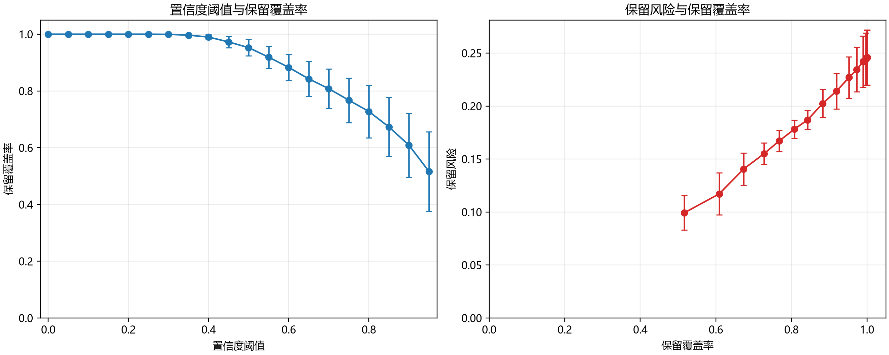

# 置信度选择性识别风险分析

本分析在冻结的测试划分上，对三个完整层级识别随机种子的预测置信度实施阈值筛选。低于阈值的样本仅建议留待后续检查，不改变原始测试划分，也不对其作工业处置推断。

## 阈值汇总

| 阈值 | 覆盖率（均值±标准差） | 保留风险（均值±标准差） | 目标代理漏选率（均值±标准差） | 含钛干扰误入目标率（均值±标准差） | 金属强负样本误入目标率（均值±标准差） |
|---:|---:|---:|---:|---:|---:|
| 0.00 | 100.00% ± 0.00% | 24.58% ± 2.59% | 22.44% ± 2.19% | 10.93% ± 3.37% | 14.39% ± 2.92% |
| 0.05 | 100.00% ± 0.00% | 24.58% ± 2.59% | 22.44% ± 2.19% | 10.93% ± 3.37% | 14.39% ± 2.92% |
| 0.10 | 100.00% ± 0.00% | 24.58% ± 2.59% | 22.44% ± 2.19% | 10.93% ± 3.37% | 14.39% ± 2.92% |
| 0.15 | 100.00% ± 0.00% | 24.58% ± 2.59% | 22.44% ± 2.19% | 10.93% ± 3.37% | 14.39% ± 2.92% |
| 0.20 | 100.00% ± 0.00% | 24.58% ± 2.59% | 22.44% ± 2.19% | 10.93% ± 3.37% | 14.39% ± 2.92% |
| 0.25 | 100.00% ± 0.00% | 24.58% ± 2.59% | 22.44% ± 2.19% | 10.93% ± 3.37% | 14.39% ± 2.92% |
| 0.30 | 99.95% ± 0.09% | 24.57% ± 2.57% | 22.44% ± 2.19% | 10.95% ± 3.40% | 14.39% ± 2.92% |
| 0.35 | 99.66% ± 0.40% | 24.44% ± 2.45% | 22.23% ± 2.56% | 10.86% ± 3.24% | 14.45% ± 2.94% |
| 0.40 | 98.99% ± 0.92% | 24.19% ± 2.43% | 21.96% ± 2.78% | 10.72% ± 2.99% | 14.37% ± 3.04% |
| 0.45 | 97.27% ± 2.03% | 23.45% ± 2.11% | 21.62% ± 2.81% | 10.36% ± 3.01% | 14.04% ± 3.47% |
| 0.50 | 95.25% ± 2.89% | 22.70% ± 1.94% | 21.21% ± 2.98% | 9.90% ± 2.69% | 14.02% ± 3.95% |
| 0.55 | 91.90% ± 3.90% | 21.41% ± 1.68% | 20.01% ± 3.18% | 9.21% ± 2.47% | 13.85% ± 4.17% |
| 0.60 | 88.29% ± 4.61% | 20.25% ± 1.33% | 18.56% ± 4.20% | 8.83% ± 3.03% | 13.18% ± 3.32% |
| 0.65 | 84.27% ± 6.25% | 18.70% ± 0.88% | 17.44% ± 3.64% | 8.68% ± 3.28% | 12.07% ± 1.81% |
| 0.70 | 80.79% ± 6.97% | 17.82% ± 0.86% | 16.74% ± 3.97% | 8.06% ± 3.03% | 12.51% ± 2.36% |
| 0.75 | 76.74% ± 7.87% | 16.71% ± 1.01% | 15.16% ± 5.19% | 7.50% ± 2.52% | 12.82% ± 2.30% |
| 0.80 | 72.77% ± 9.34% | 15.51% ± 1.01% | 14.44% ± 4.59% | 6.92% ± 2.07% | 12.25% ± 3.19% |
| 0.85 | 67.32% ± 10.33% | 14.05% ± 1.53% | 14.08% ± 4.54% | 5.88% ± 2.81% | 12.14% ± 3.23% |
| 0.90 | 60.88% ± 11.22% | 11.71% ± 1.99% | 11.03% ± 4.41% | 4.85% ± 1.84% | 11.91% ± 3.24% |
| 0.95 | 51.61% ± 13.95% | 9.92% ± 1.62% | 11.49% ± 4.94% | 3.97% ± 0.77% | 11.23% ± 4.42% |

## 图9

图中较低的覆盖率表示更多样本被延后，建议进行后续检查。

## 使用边界

保留风险和各类误入/漏选率仅描述该固定公开图像测试划分上的模型预测行为。该结果不是工业成本最优策略，也不是实际 XRF 验证、选矿回收率或生产线性能结论。
